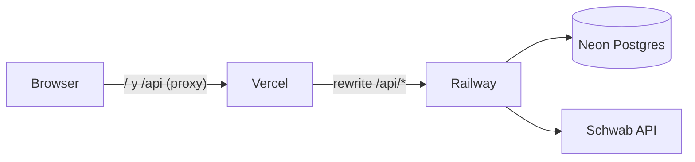

# Activos Trading

PWA multiusuario para seguimiento de activos de trading con **inicio de sesión mediante Charles Schwab** (OAuth 2.0). Cada usuario conecta su propia cuenta de Schwab, y la app carga sus operaciones para análisis y estadísticas.

## Distribución (3 servicios)

- **Vercel** → la **PWA** (frontend Vite + React). Hace *proxy* de `/api/*` hacia Railway, así el navegador ve todo en el mismo dominio (cookie de sesión first-party, clave para iOS).
- **Railway** → **toda la API** (servidor Express + Prisma). Aquí corre el OAuth de Schwab, las sesiones y los endpoints de datos.
- **Neon** → **base de datos** Postgres (usuarios y tokens cifrados).



El login ("Iniciar sesión con Schwab") es el único método de autenticación: completar el OAuth crea la sesión. Tokens cifrados en reposo (AES-256-GCM); access token se refresca solo (30 min), refresh token dura 7 días.

## Estructura

```
src/                      Frontend (PWA, se despliega en Vercel)
  App.tsx                 Puerta de sesión + dashboard
  Portfolio.tsx           Portafolio local (localStorage)
  auth/                   useSession + pantalla de login
  schwab/                 cliente API + vista de transacciones
server/                   API Express (se despliega en Railway)
  src/index.ts            servidor + rutas /api/auth y /api/schwab
  src/routes/             auth.ts, schwab.ts
  src/lib/                db (Prisma+Neon), crypto, session, schwab (oauth/cliente)
prisma/schema.prisma      modelos User y SchwabToken
vercel.json               proxy /api -> Railway
railway.json              build/start del servidor
```

## Variables de entorno (servidor / Railway)

Copia `.env.example` a `.env` y complétalo (el frontend en Vercel no necesita estas variables):

| Variable | Descripción |
| --- | --- |
| `SCHWAB_CLIENT_ID` / `SCHWAB_CLIENT_SECRET` | Credenciales de la app de Schwab |
| `SCHWAB_CALLBACK_URL` | Igual EXACTO a la registrada (dominio de Vercel) |
| `APP_BASE_URL` | URL pública del frontend (Vercel) |
| `SESSION_SECRET` | Clave de la cookie de sesión (>=32) |
| `TOKEN_ENC_KEY` | Clave AES-256 (32 bytes base64 o 64 hex) |
| `DATABASE_URL` | Connection string de Neon (con pooling) |
| `PORT` | Puerto local (Railway lo inyecta) |

Genera secretos: `openssl rand -base64 32`

## Desarrollo local

```bash
npm install
npm run dev:server      # API Express en :8080 (lee .env)
npm run dev             # PWA en :5173 (proxy /api -> :8080)
```

Base de datos:

```bash
npm run prisma:migrate  # crea tablas en Neon (necesita DATABASE_URL)
```

## Deploy

### 1. Neon
- Crea el proyecto, copia la *pooled connection string* (`DATABASE_URL`).

### 2. Railway (API)
- Nuevo proyecto desde el repo de GitHub. `railway.json` ya define build (`prisma generate`) y start (`npm run start`).
- Carga las variables de entorno (todas las de arriba; `DATABASE_URL` de Neon).
- Ejecuta las migraciones: `npm run prisma:deploy`.
- Copia el dominio público de Railway (ej. `https://activos-trading-production.up.railway.app`).

### 3. Vercel (PWA)
- Importa el repo (framework Vite).
- En `vercel.json`, reemplaza `REEMPLAZA-CON-TU-DOMINIO.up.railway.app` por el dominio real de Railway.
- Confirma que la Callback registrada en Schwab es `https://TU-DOMINIO.vercel.app/api/schwab/callback`.

### 4. Verificar
- Con la app de Schwab en *Ready For Use*: completar el login real, confirmar `/api/auth/me` autenticado y que `/api/schwab/transactions` devuelve datos.

## Notas

- Sin la app de Schwab aprobada, el botón redirige a Schwab pero el login real fallará hasta el estado *Ready For Use*.
- **“Importar”** = sincronizar compras/ventas desde la API de Schwab (ver `docs/SCHWAB_SYNC.md`). CSV/Excel no está en el roadmap actual.
- En modo Demo se usan datos mock; al conectar Schwab, el sync alimentará lotes LIFO y trades cerrados.

## Instalar en el teléfono

Abre la URL de Vercel (HTTPS) en el móvil y usa "Agregar a pantalla de inicio" (iOS Safari) o "Instalar app" (Android Chrome).
