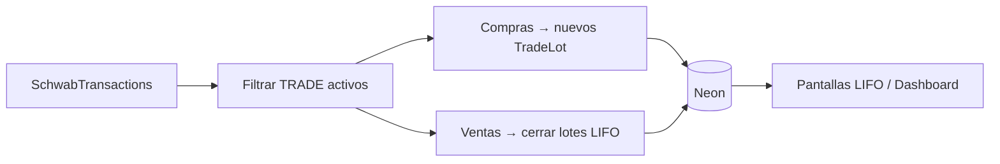

# Sincronización desde Charles Schwab (“import”)

En este proyecto **“importar”** significa **traer datos desde tu cuenta de Schwab vía API**, no subir archivos CSV/Excel.

## Alcance inicial (prioridad)

Solo operaciones de **compra y venta de activos** (acciones, ETFs, etc.) que alimenten:

- **Posiciones abiertas** → lotes de compra (`TradeLot`) con lógica LIFO.
- **Trades cerrados** → ventas que cierran o reducen lotes (`ClosedTrade`).

## Fuente de datos (Trader API — cuando esté aprobada)

| Dato | Uso |
| --- | --- |
| `GET .../accounts/accountNumbers` | Identificar cuentas del usuario |
| `GET .../accounts` | Balance / valor total (dashboard) |
| `GET .../accounts/{hash}/transactions?types=TRADE` | Compras y ventas ejecutadas |

## Pipeline de normalización

### Reglas

1. Cada **compra** crea un lote con `boughtAt`, `quantity`, `avgBuyPrice`.
2. Cada **venta** consume lotes en orden **LIFO** (última compra primero).
3. Venta parcial → `status: partial`; total → `status: closed` + `ClosedTrade`.
4. Re-sync idempotente: usar `transactionId` de Schwab como clave externa (fase 3).

## Fuera de alcance por ahora

- Importación CSV / Excel manual.
- Dividendos, intereses, transferencias entre cuentas.
- Ejecución de órdenes desde la app (solo lectura).

## Modo Demo

Mientras no hay credenciales, `MockBrokerService` simula los mismos modelos. Al aprobar Schwab, `SchwabBrokerService.syncTradesFromBroker()` reemplaza el origen sin cambiar la UI.
